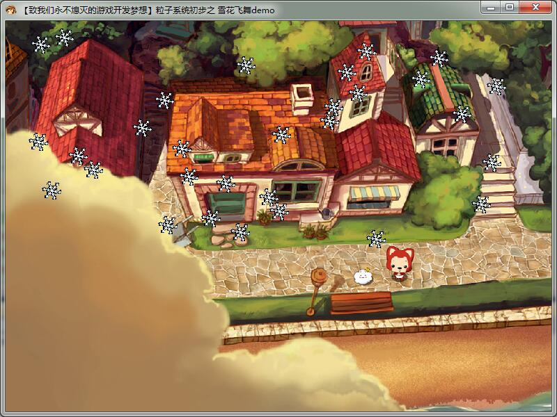
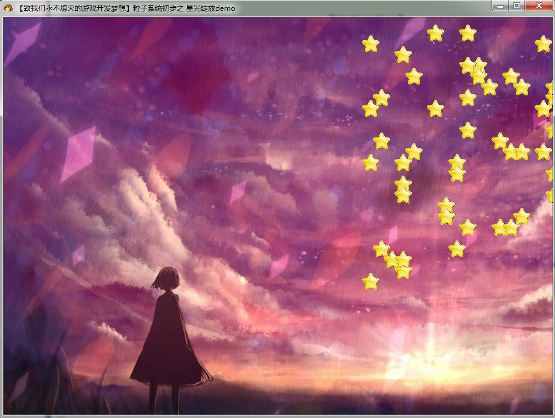

# GDI2D游戏编程

## 第二部分概览
- GDIdemoCore这个项目是GDI程序的通用框架。在GameCore的基础上，新自定义3个函数。它们分别为封装了资源初始化代码的Game_Init()函数，封装了所有绘制代码的Game_Paint()函数，以及用于清理资源的Game_CleanUp函数。
- 第四章：GDI的基本操作：GDIdemo1、2、3：GDI基本几何绘图示例程序、文字输出示例程序、位图绘制示例程序(消除闪烁缓冲显示技术)。
- 第五章：透明贴图两套体系：GDIdemo4、5：透明遮罩法与透明色彩法。
- 第六章：游戏动画技巧：GDIdemo6、7、8、9：定时器动画显示、游戏循环动画显示、透明动画示例、排序贴图示例。
- 第七章：Windows消息处理：GDIdemo10、11：键盘消息处理示例、鼠标消息处理示例。
- 第八章：物理引擎：GDIdemo12、13、14、15、16：愤怒的小鸟匀速、重力、摩擦力。粒子系统：雪花飞舞、星光绽放。
- 第九章：小型回合制游戏：GDIdemo17：《勇者斗恶龙》。

## 关键词
GDI、DC、缓冲显示、

## GDIdemoCore
### 什么是GDI
GDI(Graphics Device Interface)，即图形设备接口，GDI是Windows图形显示程序与实际物理设备之间的桥梁，GDI使得用户无需关心具体设备的细节，而只需在一个虚拟的环境（即逻辑设备）中进行操作。DC(Device Context)，设备环境，就绘图的观点而言，DC就是程序可以进行绘图的地方。
### GDIdemoCore代码示例
- [GDIdemoCore完整代码](https://github.com/xuyicpp/geme-beginner/blob/master/Windows%E6%B8%B8%E6%88%8F%E7%BC%96%E7%A8%8B%E4%B9%8B%E4%BB%8E%E9%9B%B6%E5%BC%80%E5%A7%8B/GDI2D%E6%B8%B8%E6%88%8F%E7%BC%96%E7%A8%8B/GDIdemoCore/GDIdemoCore/main.cpp)

```
//---------------------------------【Game_Init()函数】-------------------------------------
//描述：初始化函数，进行一些简单的初始化
//-----------------------------------------------------------------------------------------
BOOL Game_Init(HWND hwnd)
{
	g_hdc = GetDC(hwnd);
	Game_Paint(hwnd);
	ReleaseDC(hwnd,g_hdc);
	return TRUE;
}

//---------------------------------【Game_Paint()函数】------------------------------------
//描述：绘制函数，在此函数中进行绘制操作
//-----------------------------------------------------------------------------------------
VOID Game_Paint(HWND hwnd){}

//---------------------------------【Game_CleanUp()函数】----------------------------------
//描述：资源清理函数，在此函数中进行退出前资源的清理工作
//-----------------------------------------------------------------------------------------
BOOL Game_CleanUp(HWND hwnd)
{
	return TRUE;
}
```

## GDI的基本操作
### 字体创建、彩色文字显示示例程序
```
//---------------------------------【Game_Paint()函数】------------------------------------
//描述：绘制函数，在此函数中进行绘制操作
//-----------------------------------------------------------------------------------------
VOID Game_Paint(HWND hwnd)
{
	HFONT hFont=CreateFont(30,0,0,0,0,0,0,0,GB2312_CHARSET,0,0,0,0,L"微软雅黑");	//创建一种字体
	SelectObject(g_hdc,hFont);		//将字体选入设备环境中
	SetBkMode(g_hdc, TRANSPARENT);	//设置输出文字背景色为透明

	//定义三段文字
	wchar_t text1[]=L"我们所有的梦想都可以成真，只要我们有勇气去追求它们。";
	wchar_t text2[]=L"All our dreams can come true, if we have the courage to pursue them.";
	wchar_t text3[]=L"-----------沃尔特 迪斯尼";
	//设置文字颜色并输出第一段文字
	SetTextColor(g_hdc,RGB(50,255,50));
	TextOut(g_hdc,30,150,text1,wcslen(text1));
	//
	SetTextColor(g_hdc,RGB(50,50,255));
	TextOut(g_hdc,30,200,text2,wcslen(text2));
	//
	SetTextColor(g_hdc,RGB(255,150,50));
	TextOut(g_hdc,500,250,text3,wcslen(text3));

	DeleteObject(hFont);		//释放字体对象
}
```

### 位图绘制示例程序
位图从文件显示到程序窗口中一般可以通过以下简明扼要的四部曲：
```
//1.加载位图,从文件中加载位图对象
g_hBitmap = (HBITMAP)LoadImage(nullptr,L"Naruto.bmp",IMAGE_BITMAP,800,600,LR_LOADFROMFILE);
//2.建立兼容DC，建立一个与窗口设备环境DC兼容的内存设备环境DC
g_mdc = CreateCompatibleDC(g_hdc);
//选用位图对象，内存DC使用步骤1中所建立的位图对象
SelectObject(g_mdc,g_hBitmap);	//将位图对象选入到g_mdc内存DC中
//进行贴图，将内存DC的内容贴到窗口DC中
BitBlt(g_hdc,0,0,WINDOW_WIDTH,WINDOW_HEIGHT,g_mdc,0,0,SRCCOPY);	//采用BitBlt函数贴图，参数设置为窗口大小
```

### 消除闪烁：缓冲显示技术
双缓冲技术就是我们在其它地方（简单的来书就是不针对屏幕，不显示出来的地方）开辟一个存储空间，把所有的动画都要渲染到这个地方，而不是直接渲染到屏幕上。等到准备完成之后，再将画面整体拷贝显示到屏幕之上。
Direct3D，就是运用了通过创建多层类似于内存DC的缓存链，来实现三维画面的平滑显示，在Direct3D中把这种技术叫做交换链。

## 透明贴图两套体系
- [透明遮罩法](https://github.com/xuyicpp/geme-beginner/blob/master/Windows%E6%B8%B8%E6%88%8F%E7%BC%96%E7%A8%8B%E4%B9%8B%E4%BB%8E%E9%9B%B6%E5%BC%80%E5%A7%8B/GDI2D%E6%B8%B8%E6%88%8F%E7%BC%96%E7%A8%8B/GDIdemo4/GDIdemo4/main.cpp)，它主要是利用BitBlt()函数中Raster(光栅)值的运算，来将图片中我们不希望出现的部分处理掉。
- [透明色彩法](https://github.com/xuyicpp/geme-beginner/blob/master/Windows%E6%B8%B8%E6%88%8F%E7%BC%96%E7%A8%8B%E4%B9%8B%E4%BB%8E%E9%9B%B6%E5%BC%80%E5%A7%8B/GDI2D%E6%B8%B8%E6%88%8F%E7%BC%96%E7%A8%8B/GDIdemo5/GDIdemo5/main.cpp)，利用在贴图时可以设置某种颜色为透明色的函数，比如TransparentBlt()函数、AlphaBlend()函数等达到直观的透明背景显示方法

## 游戏动画技巧

### 定时器动画显示
在Windows中，定时器是一种输入设备，它周期性地在每经过一个指定的时间间隔就通知应用一次。定时器使用三部曲：
- 创建定时器
- 编写WM_TIMER消息响应代码
- 删除定时器
但是WM_TIMER消息并不是异步的。WM_TIMER消息放在正常的消息队列之中，和其他消息队列排列在一起。如果其他程序的执行事件超过一秒，我们程序将会收不到任何WM_TIMER消息。所以有可能导致卡顿与掉帧。

### 游戏循环动画显示
“游戏循环”是将我们之前程序中的消息循环加以修改，方法是判断其中的内容目前是否有要处理的消息，如果有则进行处理，否则按照设定的时间间隔来重绘画面。采用“游戏循环”的执行效率足以秒杀采用定时器的游戏程序。
```
	//【5】消息循环过程
	MSG msg = {0};	//定义并初始化msg
	while(msg.message != WM_QUIT)	//使用while循环，如果消息不是WM_QUIT，就继续循环
	{
		if(PeekMessage(&msg,0,0,0,PM_REMOVE))	//查看应用程序消息队列，有消息时将队列中的消息派发出去
		{
			TranslateMessage(&msg);	//将虚拟键消息转换为字符消息
			DispatchMessageW(&msg);	//分发一个消息给窗口程序
		}
		else
		{
			g_tNow = GetTickCount();		//获取当前系统时间
			if(g_tNow-g_tPre >= 100)		//当此次循环运行与上次绘图时间相差0.1秒时再近些重绘
				Game_Paint(hwnd);
		}
	}
```
## Windows消息处理
[Windows键盘消息处理](https://github.com/xuyicpp/geme-beginner/blob/master/Windows%E6%B8%B8%E6%88%8F%E7%BC%96%E7%A8%8B%E4%B9%8B%E4%BB%8E%E9%9B%B6%E5%BC%80%E5%A7%8B/GDI2D%E6%B8%B8%E6%88%8F%E7%BC%96%E7%A8%8B/GDIdemo8/GDIdemo8/main.cpp)、[Windows鼠标消息处理](https://github.com/xuyicpp/geme-beginner/blob/master/Windows%E6%B8%B8%E6%88%8F%E7%BC%96%E7%A8%8B%E4%B9%8B%E4%BB%8E%E9%9B%B6%E5%BC%80%E5%A7%8B/GDI2D%E6%B8%B8%E6%88%8F%E7%BC%96%E7%A8%8B/GDIdemo9/GDIdemo9/main.cpp)

## 物理引擎
愤怒的小鸟匀速、重力、摩擦力。粒子系统：雪花飞舞、星光绽放



## 小型回合制游戏
- [《勇者斗恶龙》](https://github.com/xuyicpp/geme-beginner/tree/master/Windows%E6%B8%B8%E6%88%8F%E7%BC%96%E7%A8%8B%E4%B9%8B%E4%BB%8E%E9%9B%B6%E5%BC%80%E5%A7%8B/GDI2D%E6%B8%B8%E6%88%8F%E7%BC%96%E7%A8%8B/GDIdemo17)